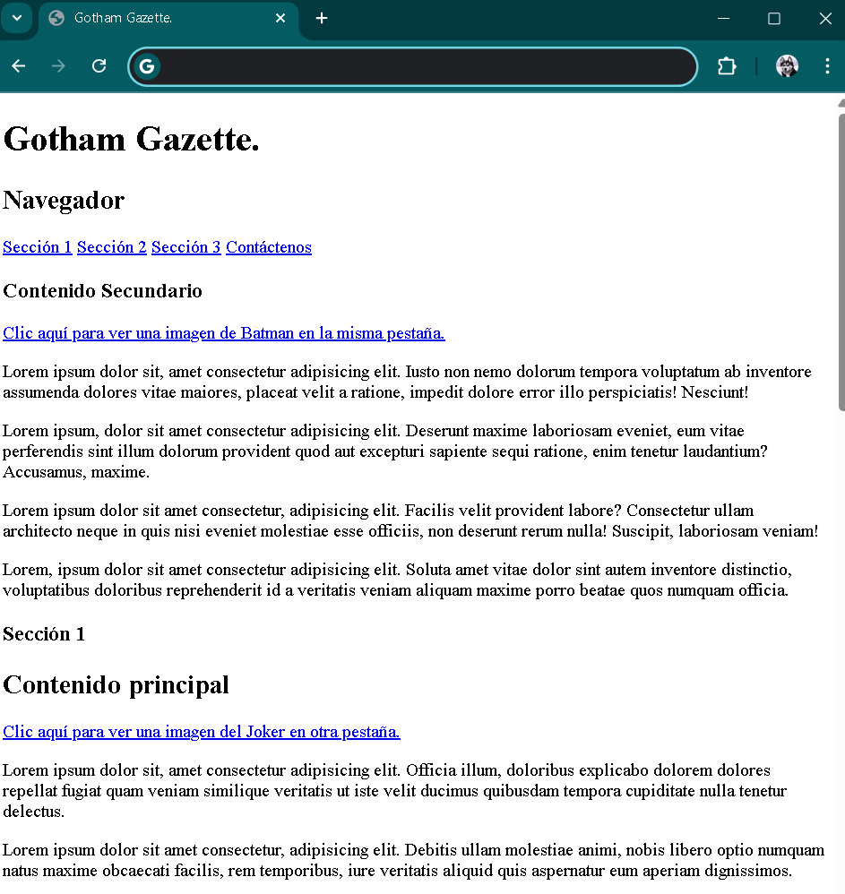
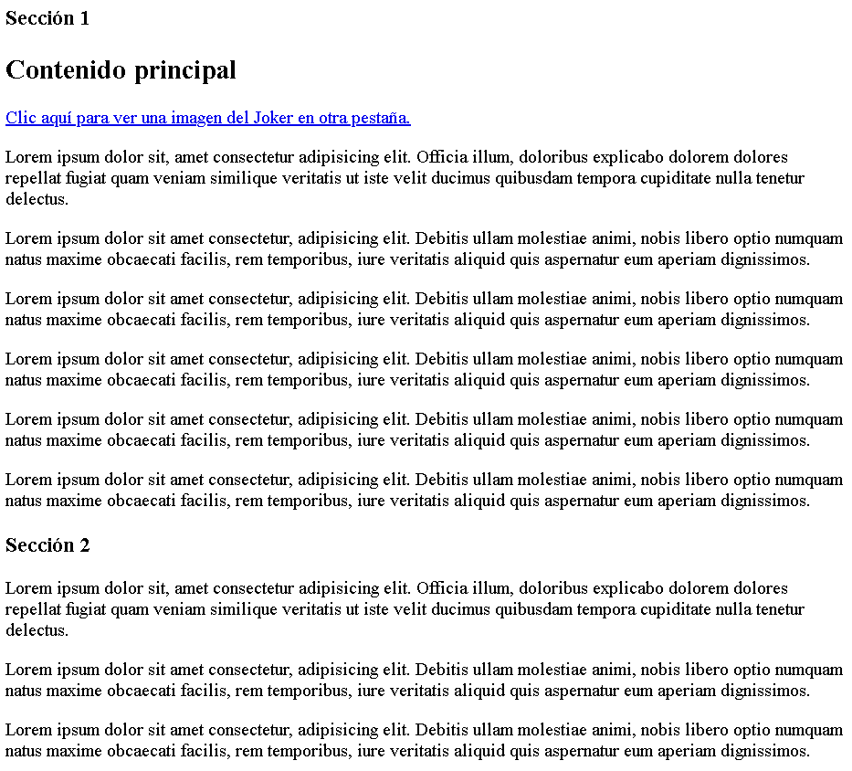
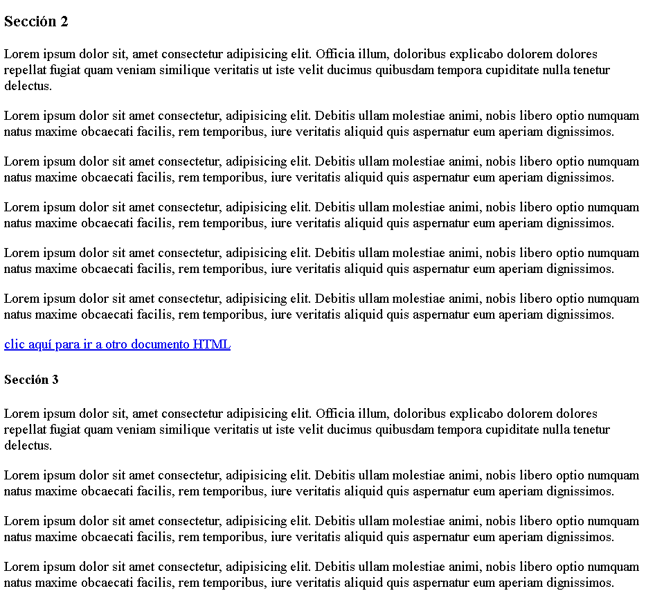
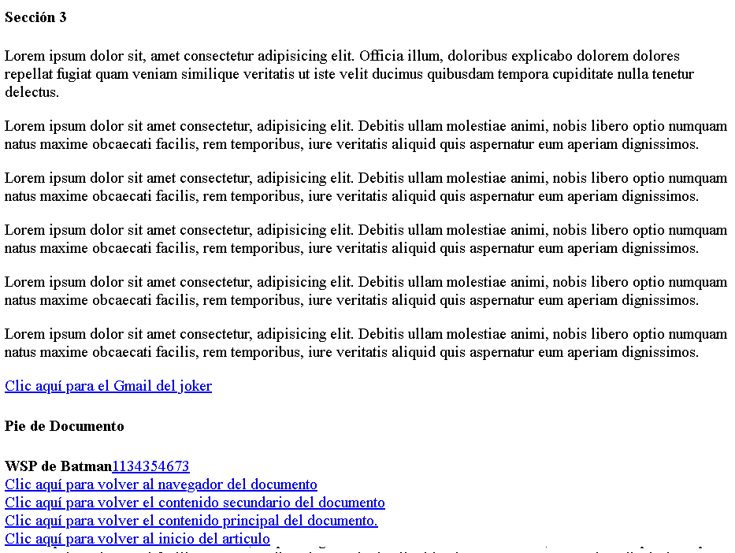
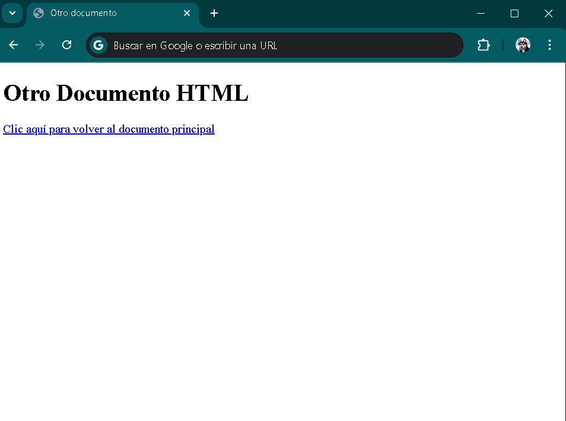
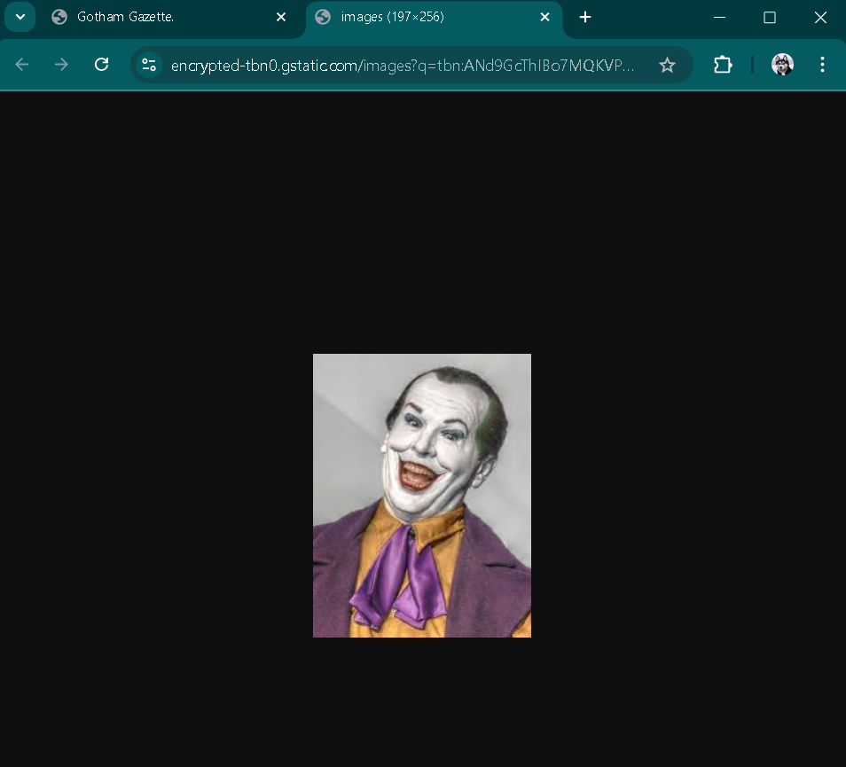
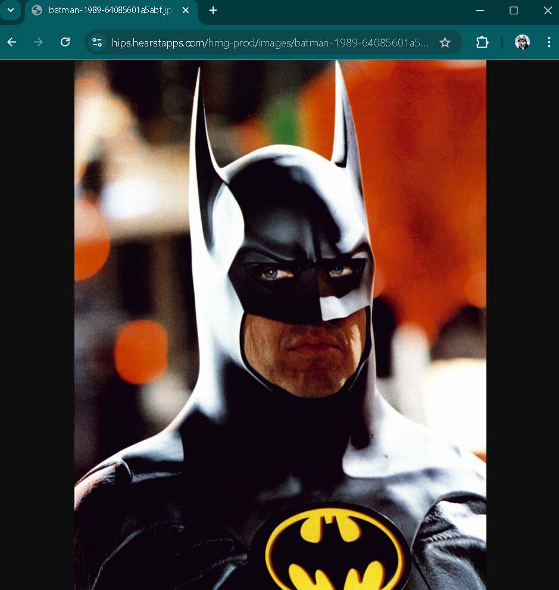

# Etiqueta a `Ejercicio 2`.

- Realice un documento `HTML`, en base a las siguientes imagenes:

- Debes prestar atención incluso al título de la pestaña, que en este caso es *Gotham Gazette*. El primer título del documento está definido con una etiqueta `h1`, y debe estar ubicado como encabezado dentro de la etiqueta `header`. A continuación, se encuentra el bloque de navegación en el cual tiene una `h2` con contenido de *Navegador* y es hijo de la etiqueta `nav`, el cual contiene como elementos hijos a cuatro equetas `a`, cada una con su respectivo contenido:

    - Sección 1
    - Sección 2
    - Sección 3
    - Contáctenos

**Sección 1**: Debe incluir un anclaje mediante el atributo `id` que dirija hacia la primera sección del documento.

**Sección 2**: Debe contener un anclaje con `id`, apuntando específicamente a la segunda sección del documento.

**Sección 3**: Debe realizar el anclaje utilizando `class`, y debe llevar al usuario hacia la tercera sección del documento.

**Contáctenos**: Debe contar con un anclaje con `class` hacia el `footer` del documento.

*Todas las secciónes son etiquetas `section`*

El contenido secundario debe estar dentro de la etiqueta `article`. El título *Contenido Seccundario* debe utilizar la etiqueta `h3`, pero a su vez, debe ser un hijo de la etiqueta `aside`. Dentro del `aside`, se debe incluir `a` con el texto *Clic aquí para ver una imagen de Batman en la misma pestaña*, cuyo atributo `href` debe apuntar a la siguiente dirección: `https://hips.hearstapps.com/hmg-prod/images/batman-1989-64085601a5abf.jpg`.

El contenido principal debe estar dentro de la sección 1, la cual debe contener un título con la etiqueta `h3`. A su vez, el contenido principal debe ser hijo de la sección 1 y también del `main`. El título de *Contenido principal* debe utilizar una etiqueta `h2`. Además, dentro del `main`, se debe incluir una etiqueta `a` con el texto *Clic aquí parar ver una imagen del Joker en otra pestaña*, cuyo atributo `href` debe contener la siguiente dirección: `https://encrypted-tbn0.gstatic.com/images?q=tbn:ANd9GcThIBo7MQKVPHW2VNMTHqztbUi0pL_azdLWGw&s`. La imagen debe abrirse en una nueva pestaña al hacer clic en el enlace.

La sección 2 debe estar dentro de una etiqueta `section`. El título del contenido dentro se está sección debe utilizar una etiqueta `h3`. Al final de la sección, se debe incluir una etiqueta `a` con el texto *Clic aquí para ir a otro documento HTML*, que al hacer clic redirija al usuario a otro documento `HTML` creado por nosotro. Este documento debe seguir el estándar básico de `HTML5` y, dentro de su `body`, debe contener un `h1` con el texto *Otro documento*. Además, el `title` del documento debe tener el mismo contenido que el `h1`.

Dentro de este segundo documento, debe incluirse una etiqueta `a` con el texto *Clic aquí para volver al documento principal*, que al hacer clic redirija nuevamente al documento principal

La sección 3 debe ser hijo de otra etiqueta `section`. Y el titulo *Sección 3*, debe ser con una etiqueta `h3`. Además al final de la sección debe haber una etiqueta `a` con el atributo especifico para `Email` que es `mailto: `, el contenido de la etiqueta debe ser *Clic aquí para el Gmail del joker*, y el Gmail del Joker es: `joker@gmail.com`

Por último, el pie del documento debe estar fuera del `article` y representarse con una etiqueta `footer`. Dentro de este `footer`, debe incluirse un título con la etiqueta `h4` que contenga el texto *Pie de Documento*. Además del título, debe hacer una etiqueta `a` con el atributo `href` configurado para realizar una llamada telefónica, utilizando la declaración: `tel: +1134354673`. A continuación, debe haber otra etiqueta `a` que redirija al navegador al inicio del documento. seguido de esta, otro enlace que redirija al contenido secundario, un tercero que dirija al *Contenido Principal* y, por último, un cuarto enlace que lleve al `article` del documento.

## Video ilustrativo.

<video src="Videos/video1.mp4" controls=""> </video>
